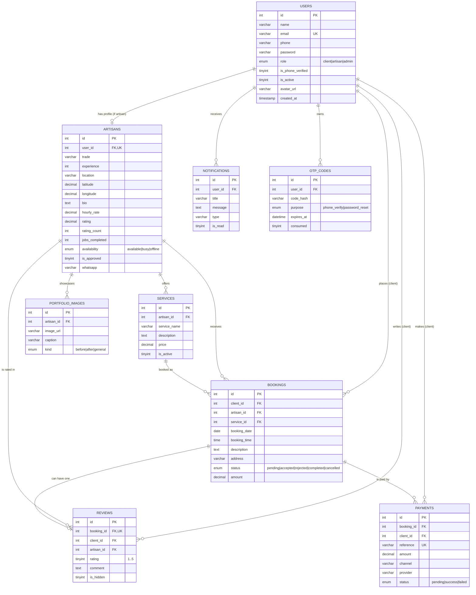
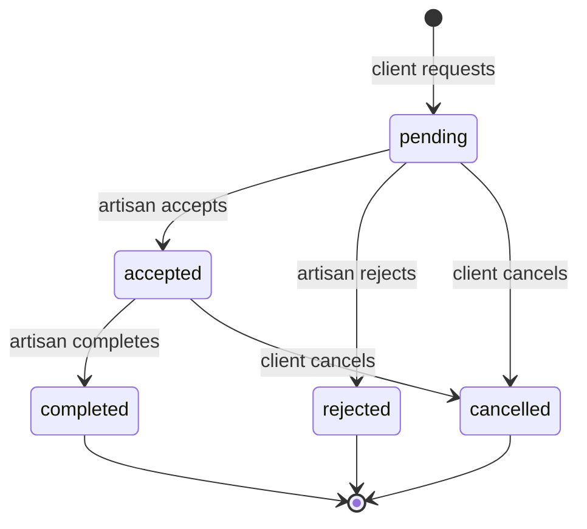

# Entity-Relationship Diagram

The database for the **Artisan Services Platform (Koforidua Municipality)**.
Rendered with Mermaid — viewable on GitHub or any Mermaid-compatible Markdown viewer.

## Relationships at a glance

| From | To | Type | Meaning |
| --- | --- | --- | --- |
| users → artisans | 1 : 0..1 | A user with role `artisan` has exactly one artisan profile |
| users → bookings | 1 : N | A client places many bookings |
| artisans → bookings | 1 : N | An artisan receives many bookings |
| services → bookings | 1 : N | A booking may reference a service |
| bookings → reviews | 1 : 0..1 | A completed booking can have one review |
| bookings → payments | 1 : N | A booking can have payment attempts |
| artisans → services / portfolio_images | 1 : N | Profile content |
| users → notifications / otp_codes | 1 : N | Per-user records |

## Booking status lifecycle

